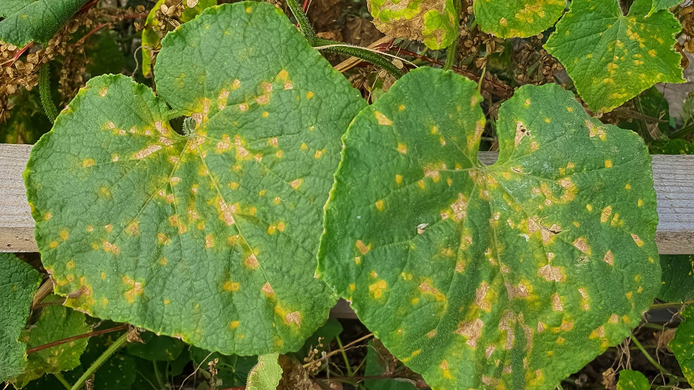

# Downy Mildew

## Overview

**Downy mildew** is a destructive group of plant diseases caused by **oomycetes** (water molds), which are fungus-like microorganisms but biologically different from true fungi. The disease affects many economically important crops worldwide and can cause severe yield losses, quality reduction, and post-harvest problems.

Downy mildew pathogens thrive under conditions of:

- High humidity
- Leaf wetness
- Poor air circulation
- Moderate temperatures
- Frequent rain or irrigation events

The disease spreads rapidly in dense canopies and can devastate crops if not detected and managed early.

---

# Causal Organisms

Downy mildew is caused by several genera of oomycetes, including:

| Pathogen Genus | Common Host Crops |
|---|---|
| *Plasmopara* | Grapes, sunflower |
| *Peronospora* | Onion, spinach, brassicas |
| *Pseudoperonospora* | Cucurbits, hops |
| *Bremia* | Lettuce |
| *Hyaloperonospora* | Brassicaceae |

Unlike true fungi:

- Oomycetes have cellulose-rich cell walls
- Produce motile zoospores
- Require free moisture for infection
- Often respond differently to fungicides

---

# Major Crops Affected

## Grapes

One of the most economically damaging forms is **grapevine downy mildew** caused by *Plasmopara viticola*.

### Symptoms
- Yellow oil-like spots on upper leaves
- White fluffy growth on underside
- Leaf necrosis
- Berry shriveling
- Defoliation

### Impact
- Severe reduction in sugar accumulation
- Poor fruit quality
- Yield loss exceeding 70% in severe epidemics

---

## Cucurbits

Affected crops:
- Cucumber
- Melon
- Watermelon
- Pumpkin
- Squash

### Symptoms
- Angular chlorotic lesions
- Gray-purple sporulation
- Rapid canopy collapse

---

## Onion

Caused by *Peronospora destructor*.

### Symptoms
- Pale elongated lesions
- Violet-gray mold
- Leaf collapse
- Reduced bulb development

---

## Sunflower

Caused by *Plasmopara halstedii*.

### Symptoms
- Stunting
- Chlorosis
- White sporulation
- Root system abnormalities

---

# Disease Cycle

## 1. Survival Phase

The pathogen survives as:
- Oospores in soil
- Infected crop residues
- Volunteer plants
- Alternative hosts
- Infected seed (in some species)

Oospores can remain viable for several years.

---

## 2. Primary Infection

Under favorable environmental conditions:

- Oospores germinate
- Sporangia or zoospores are produced
- Infection occurs through stomata or young tissues

Critical requirements:
- Free water
- High relative humidity (>85%)
- Suitable temperatures

---

## 3. Secondary Spread

Secondary epidemics occur through:

- Wind-dispersed sporangia
- Rain splash
- Irrigation water
- Mechanical transmission

Disease progression may become explosive during wet periods.

---

# Environmental Conditions Favoring Disease

| Factor | Favorable Range |
|---|---|
| Relative humidity | >85% |
| Leaf wetness duration | >4–6 hours |
| Temperature | 10–25°C |
| Rainfall | Frequent |
| Dense canopy | Strongly favors disease |

---

# Symptoms and Identification

## Leaf Symptoms

### Early Stage
- Pale green spots
- Chlorosis
- Angular lesions

### Advanced Stage
- Necrosis
- Leaf curling
- Tissue collapse

---

## Sporulation

Typical downy mildew sporulation appears as:

- White
- Gray
- Violet
- Purple fuzzy growth

Usually found on:
- Leaf undersides
- Young tissues
- Humid canopy zones

---

## Stem and Fruit Symptoms

Depending on crop:
- Stem lesions
- Fruit rot
- Berry shriveling
- Flower abortion
- Stunting

---

# Diagnostic Methods

## Field Diagnosis

Key indicators:
- Angular chlorotic lesions
- Sporulation under humid conditions
- Rapid spread after rain

---

## Laboratory Diagnosis

Methods include:
- Microscopic examination
- Spore morphology analysis
- PCR diagnostics
- Molecular pathogen identification

---

# Economic Impact

Downy mildew can cause:

| Impact Type | Consequence |
|---|---|
| Yield loss | 10–100% |
| Quality reduction | Severe |
| Storage losses | Increased |
| Fungicide costs | High |
| Export limitations | Possible |

In high-value crops such as grapes and cucurbits, uncontrolled outbreaks can lead to complete crop failure.

---

# Integrated Disease Management (IDM)

Successful control requires an integrated strategy.

---

# 1. Resistant Varieties

The most sustainable control method.

## Advantages
- Reduced fungicide use
- Lower production costs
- Improved environmental sustainability

## Limitations
- Resistance breakdown may occur
- Limited availability in some crops

---

# 2. Crop Rotation

Avoid planting susceptible hosts repeatedly.

## Recommendations
- Rotate 2–4 years where possible
- Reduce volunteer plants
- Remove alternative hosts

---

# 3. Canopy Management

Reducing humidity inside the canopy is critical.

## Practices
- Proper row spacing
- Pruning
- Defoliation
- Weed management
- Controlled nitrogen fertilization

Dense canopies dramatically increase infection risk.

---

# 4. Irrigation Management

## Recommended
- Drip irrigation
- Morning irrigation

## Avoid
- Night overhead irrigation
- Prolonged leaf wetness

---

# 5. Sanitation

Important sanitation practices:
- Remove infected residues
- Destroy volunteer plants
- Clean equipment
- Use healthy transplants

---

# Fungicide Management

## Important Note

Because oomycetes are not true fungi, some fungicides are ineffective.

---

# Fungicide Groups Commonly Used

| FRAC Group | Active Ingredients | Mode of Action |
|---|---|---|
| 40 | Mandipropamid | Cell wall synthesis |
| 43 | Fluopicolide | Membrane disruption |
| 45 | Ametoctradin | Respiration inhibition |
| 49 | Oxathiapiprolin | Lipid transfer protein inhibition |
| M-group | Copper compounds | Multi-site protectant |

---

# Resistance Management

Downy mildew pathogens can rapidly develop fungicide resistance.

## Best Practices
- Rotate FRAC groups
- Use mixtures
- Avoid repeated applications
- Follow label rates
- Integrate non-chemical controls

---

# Forecasting and Decision Support Systems

Modern agriculture increasingly relies on disease forecasting.

## Key Inputs
- Relative humidity
- Leaf wetness duration
- Temperature
- Rainfall
- Canopy microclimate

---

# Digital Agriculture Applications

Precision agriculture tools include:
- Weather stations
- IoT humidity sensors
- Leaf wetness sensors
- Remote sensing
- NDVI monitoring
- Satellite imagery
- Drone scouting
- AI disease prediction models

These systems help optimize fungicide timing and reduce unnecessary applications.

---

# Remote Sensing Indicators

## Possible Indicators
- Chlorophyll reduction
- Canopy temperature changes
- Reduced NDVI
- Altered reflectance patterns

However, symptoms may become visible only after infection has progressed.

---

# Downy Mildew vs Powdery Mildew

| Feature | Downy Mildew | Powdery Mildew |
|---|---|---|
| Organism type | Oomycete | True fungus |
| Moisture requirement | High | Lower |
| Sporulation location | Underside of leaf | Upper leaf surface |
| Humidity dependence | Very high | Moderate |
| Free water needed | Usually yes | Usually no |

---

# Climate Change and Disease Pressure

Climate change may increase downy mildew pressure due to:

- Increased humidity
- More extreme rainfall events
- Warmer nights
- Longer growing seasons

Regions previously unsuitable for severe epidemics may become vulnerable.

---

# Organic Farming Approaches

Organic systems rely heavily on preventive management.

## Common Tools
- Copper-based products
- Resistant cultivars
- Biological products
- Airflow management
- Sanitation

---

# Biological Control

Biological approaches include:
- *Bacillus* spp.
- *Trichoderma* spp.
- Plant extracts
- Induced resistance compounds

Biological control is usually most effective when integrated with other practices.

---

# Monitoring and Scouting Protocol

## Recommended Scouting Frequency

| Growth Stage | Frequency |
|---|---|
| Early vegetative | Weekly |
| High-risk weather | Every 2–3 days |
| Epidemic conditions | Daily |

---

# What to Monitor

- Lower canopy humidity
- First chlorotic lesions
- Sporulation
- Weather forecasts
- Irrigation events

---

# Best Management Strategy Summary

## Most Effective Integrated Program

1. Resistant cultivars
2. Crop rotation
3. Canopy ventilation
4. Proper irrigation
5. Early scouting
6. Weather-based forecasting
7. Preventive fungicide applications
8. FRAC rotation
9. Sanitation
10. Precision agriculture monitoring

---

# Key Takeaways

- Downy mildew is among the most destructive oomycete diseases in agriculture.
- Moisture and humidity are the primary drivers of epidemics.
- Early detection is essential for successful control.
- Integrated management is far more effective than relying only on fungicides.
- Precision agriculture technologies are becoming increasingly important for disease forecasting and management.
- Fungicide resistance management is critical for long-term sustainability.

---

# Additional Resources

## Organizations
- EPPO (European and Mediterranean Plant Protection Organization)
- FAO
- FRAC
- APS (American Phytopathological Society)

## Recommended Monitoring Data
- Relative humidity
- Leaf wetness
- Rainfall
- Temperature
- NDVI trends
- Canopy density

---

# Glossary

| Term | Definition |
|---|---|
| Oomycete | Fungus-like microorganism |
| Sporangia | Spore-producing structure |
| Zoospore | Motile spore with flagella |
| Oospore | Thick-walled survival spore |
| Sporulation | Production of spores |
| FRAC | Fungicide Resistance Action Committee |
| Leaf wetness | Duration of moisture on leaf surfaces |
