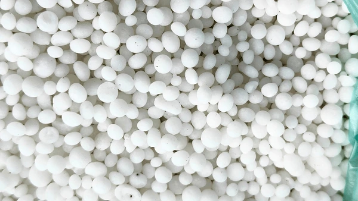
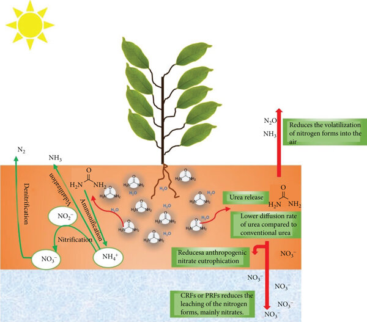

# Urée (CO(NH₂)₂)

## Présentation

**L'urée** est l'engrais **azoté (N)** le plus utilisé dans l'agriculture mondiale. C'est un composé organique synthétique contenant **46 % d'azote**, ce qui en fait l'engrais solide azoté le plus concentré disponible sur le marché.

En raison de sa teneur élevée en azote, de son faible coût par unité N et de son efficacité logistique, l'urée est la principale source d'azote dans les systèmes intensifs de céréales, de maïs, de riz et d'horticulture.

Cependant, l'urée est également très sensible aux pratiques d'application. Une mauvaise utilisation entraîne des **pertes d'azote importantes par volatilisation, lessivage et risque de dommages aux cultures**.

---

# Propriétés chimiques

| Propriété | Valeur |
|---|---|
| Formule chimique | CO(NH₂)₂ |
| Teneur en azote | 46 % |
| Forme physique | Granulés / prills |
| Solubilité | Très soluble dans l'eau |
| Effet sur le pH (initial) | Zone temporairement alcaline dans le sol |

Après application, l'urée est rapidement hydrolysée par l'enzyme **uréase**, la convertissant en formes ammoniacales utilisables par les plantes.

---

# Transformation dans le sol

L'urée n'agit pas directement comme azote disponible pour les plantes. Elle subit plusieurs transformations :

## 1. Hydrolyse
Urée → carbonate d'ammonium (via l'activité de l'uréase)

- Se produit en quelques heures à quelques jours
- Fortement influencée par la température et l'humidité

## 2. Formation d'ammonium
- Le NH₄⁺ devient disponible pour l'absorption racinaire
- Peut être retenu par les colloïdes du sol (fixation CEC)

## 3. Nitrification
- NH₄⁺ → NO₃⁻
- Processus conduit par les bactéries du sol
- Augmente le risque de lessivage

---

# Voies de pertes en azote

## 1. Volatilisation ammoniacale (principale voie de perte)

Lors d'une application en surface, une zone à pH élevé se forme temporairement, entraînant des **pertes de NH₃ gazeux dans l'atmosphère**.

- Les pertes peuvent dépasser 30 % dans des conditions défavorables
- Dans des cas extrêmes, jusqu'à ~60 % de pertes d'azote ont été rapportées

### Facteurs de risque :
- Température élevée
- Surface du sol sèche
- Sols à pH élevé
- Résidus en surface (systèmes en semis direct)
- Exposition au vent

---

## 2. Lessivage

Après nitrification :
- Le nitrate (NO₃⁻) est très mobile
- Se déplace sous la zone racinaire dans les sols sableux ou sous de fortes précipitations

---

## 3. Dénitrification

Se produit dans :
- Les sols gorgés d'eau
- Les conditions anaérobies

NO₃⁻ → N₂ / N₂O (pertes gazeuses, émissions de gaz à effet de serre)

---

# Avantages agronomiques de l'urée

## Avantages

- Haute concentration en azote (46 %)
- Faible coût de transport par unité N
- Compatible avec plusieurs méthodes d'application
- Adapté aux systèmes irrigués et en sec
- Peut être mélangée à d'autres engrais

---

# Réponse des cultures

L'urée est largement utilisée pour :

- Le blé et l'orge (épandage de couverture)
- Le maïs (apports fractionnés)
- Le riz (systèmes inondés avec adaptations)
- Les prairies et systèmes fourragers
- Les légumes et cultures horticoles

L'azote de l'urée est indispensable pour :
- La synthèse de la chlorophylle
- La croissance végétative
- La formation des protéines
- La formation du rendement en céréales

---

# Méthodes d'application

## 1. Incorporation dans le sol (recommandée)

- Incorporer immédiatement après l'application
- Minimise les pertes par volatilisation
- Méthode la plus efficace

---

## 2. Application en surface (risquée)

En cas d'application en surface :
- Appliquer avant une pluie ou une irrigation
- Utiliser des inhibiteurs d'uréase si approprié
- Éviter les conditions chaudes et sèches

---

## 3. Application en bandes

- Placer l'urée à 5–7 cm de profondeur ou éloignée des semences
- Réduit le risque de brûlure des semences
- Améliore l'efficacité d'utilisation de l'azote

---

## 4. Application foliaire (utilisation limitée)

- Faibles concentrations uniquement
- Risque de brûlure foliaire à des doses élevées
- Principalement utilisée pour la correction et non comme apport principal d'azote

---

# Conditions environnementales influençant l'efficacité

| Facteur | Effet |
|---|---|
| Température élevée | Augmente la volatilisation |
| Faible humidité du sol | Ralentit l'incorporation, augmente les pertes |
| Sol à pH élevé | Favorise la formation de NH₃ |
| Forte couverture résiduelle | Augmente l'activité de l'uréase |
| Vent | Amplifie les pertes gazeuses |

---

# Bonnes pratiques agricoles (BPA)

## 1. Calendrier d'application

- Appliquer avant des événements pluvieux ou d'irrigation
- Éviter l'application lors des pics de chaleur

---

## 2. Incorporation

- Incorporation mécanique ou irrigation (> 10–15 mm d'eau)

---

## 3. Application fractionnée

- Réduit le risque de pertes
- S'adapte à la courbe de demande en azote de la culture

---

## 4. Engrais stabilisés

- Inhibiteurs d'uréase (ex. NBPT)
- Inhibiteurs de nitrification (si approprié)

---

## 5. Analyse de sol

- Baser les décisions d'apport azoté sur l'analyse du sol
- Éviter la surdose

---

# Compatibilité des engrais

## Compatible avec :
- DAP (phosphate diammonique)
- MAP (phosphate monoammonique)
- Chlorure de potassium (KCl)

## Précautions :
- Éviter le mélange avec des matières sensibles à l'humidité
- Éviter un stockage inapproprié en atmosphère humide

---

# Urée vs. autres engrais azotés

| Engrais | Teneur en N | Risque de volatilisation | Mobilité |
|---|---|---|---|
| Urée | 46 % | Élevé (application en surface) | Élevée après conversion |
| Solution UAN | 28–32 % | Modéré | Élevée |
| Nitrate d'ammonium | ~34 % | Plus faible | Modérée |

---

# Importance économique

L'urée domine les marchés mondiaux des engrais azotés grâce à :

- Le coût le plus bas par kg N
- Une logistique efficace
- Une disponibilité élevée
- La scalabilité de la production industrielle

Cependant, l'efficacité économique dépend fortement de :
- La méthode d'application
- Les conditions météorologiques
- Le type de sol

---

# Considérations environnementales

## Émissions de gaz à effet de serre

- Émissions indirectes de N₂O issues de la nitrification/dénitrification
- La volatilisation de NH₃ contribue aux dépôts azotés dans d'autres zones

## Risque de pollution de l'eau

- Lessivage des nitrates dans les eaux souterraines
- Eutrophisation des eaux de surface

---

# Applications en agriculture de précision

La gestion moderne de l'azote recourt de plus en plus à :

- La cartographie du statut azoté par NDVI
- L'épandage à dose variable
- La cartographie de la conductivité électrique du sol
- La modélisation azotée basée sur la météo
- Les algorithmes de stade de développement cultural

Ces outils améliorent considérablement l'efficacité d'utilisation de l'azote et réduisent les pertes.

---

# Erreurs de gestion fréquentes

- Application en surface sans incorporation
- Application avant des périodes chaudes et sèches
- Surdosage au-delà de la demande de la culture
- Négliger le pH du sol et les conditions de résidus
- Ne pas utiliser d'inhibiteurs dans les conditions à risque élevé

---

# Points clés à retenir

- L'urée est l'engrais azoté le plus utilisé dans le monde grâce à sa haute teneur en azote et son faible coût.
- Son efficacité dépend fortement de l'**incorporation rapide dans le sol ou des précipitations après l'application**.
- Le principal risque agronomique est la **volatilisation ammoniacale lors d'une application en surface**.
- Une gestion appropriée (calendrier, placement, inhibiteurs) peut améliorer considérablement l'efficacité d'utilisation de l'azote.
- L'urée doit être traitée comme un intrant à haute performance mais à haute sensibilité nécessitant un contrôle agronomique rigoureux.

---