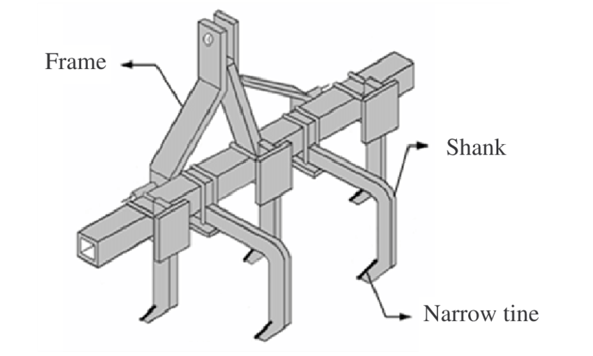

# Lazítós talajművelés (chisel)

## Áttekintés

A **lazítós talajművelés** (más néven **chisel-szántás**) egy **elsődleges vagy másodlagos csökkentett talajmunkás rendszer**, amely keskeny, függőleges vagy enyhén szögben álló szárakkal (chisel-tüskékkel) töri fel a talajt anélkül, hogy megfordítaná azt.

A hagyományos szántással ellentétben a lazítós talajművelés:
- Nem fordítja teljesen fel a talajréteget
- Megőrzi a felszíni maradványokat
- Csökkenti az erózió kockázatát
- Javítja a vízbeszivárgást sok talajtípusnál

Széles körben alkalmazzák a **konzerváló talajművelési rendszerekben**, mint a hagyományos szántás és a direktvetés közötti kompromisszum.

---

# A lazítós talajművelés céljai

A főbb agronómiai célok:

- Talajlazítás és tömörödés enyhítése
- Maradványok részleges bedolgozása
- Jobb gyökérterjedés
- Fokozott vízbeszivárgás
- Gyomszabályozás (mechanikus visszaszorítás)
- Magágyelőkészítés (kombinált rendszerekben)

---

# Gépek és működési elvek

## A chisel-kultivátorrendszer felépítése

Egy tipikus chisel-kultivátor összetevői:

- Váz (merev vagy rugalmas)
- Több szár (tüske)
- Szárnyas talp vagy keskeny hegy
- Mélységszabályozó kerekek
- Opcionális hengerek vagy boronák

---

## Működési mechanizmus

A chisel-tüskék behatolnak a talajba és létrehoznak:

- Függőleges repedéseket
- Mikrolazítási zónákat
- Részleges emelkedést megfordítás nélkül

Ez a következőkhöz vezet:
- Megnövekedett makroporozitás
- Csökkentett felszíntömörödés
- Javított hidraulikus vezető képesség

---

# Munkamélység és -intenzitás

| Paraméter | Tipikus tartomány |
|---|---|
| Munkamélység | 10–30 cm |
| Szárközök | 20–40 cm |
| Sebesség | 6–12 km/h |

Mélyebb művelés alkalmazható:
- Eketalp feltörésére
- Gyökérzóna javítására
- Hosszú távú tömörödési rétegek megszüntetésére

---

# Talajfizikai hatások

## 1. Térfogattömeg-csökkentés

A lazítós talajművelés átmenetileg csökkenti a térfogattömeget:
- Tömörödött rétegek feltörésével
- A póruskontinuitás növelésével

Az újbóli tömörödés azonban idővel bekövetkezhet a csapadék és a gépi forgalom hatására.

---

## 2. Porozitásváltozások

- Növekvő makroporozitás
- Javult szellőzés
- Kedvezőbb gyökérnövekedési feltételek

---

## 3. Vízbeszivárgás

A lazítós talajművelés általában:
- Javítja a beszivárgást tömörödött talajokon
- Csökkenti a felszíni lefolyást
- Kisebb erózióveszélyt jelent, mint a forgató művelés

---

# Talajnedvesség-dinamika

A hatás erősen függ a talajtípustól:

### Pozitív hatások:
- Jobb beszivárgás csapadék után
- Mélyebb gyökérzóna hozzáférés a vízhez

### Negatív hatások:
- Fokozott párolgás, ha a maradványborítás alacsony
- Nedvességveszteség száraz éghajlaton, helytelen időzítés esetén

---

# Maradványgazdálkodás

A lazítós talajművelés **csökkentett talajmunkás** eljárásként:

- 30–70%-ban megmaradhatnak a felszíni maradványok
- Egy részük belekeveredik a felső talajrétegekbe

A maradványmegőrzés előnyei:
- Erózióvédelem
- Nedvességmegőrzés
- Javuló talajszerves-anyag körforgás

---

# Gyomszabályozási hatások

A lazítós talajművelés **mechanikus gyomvisszaszorítást** biztosít:

- Csíranövények kiszakításával
- Felszíni gyomok betemetésével
- Gyökérrendszerek megzavarásával

Korlátok:
- Nem biztosít teljes körű gyomszabályozást
- Modern rendszerekben általában herbicidek alkalmazása is szükséges

---

# Energiafelhasználás és üzemanyag-igény

Más talajmunkás rendszerekkel összehasonlítva:

| Rendszer | Üzemanyag-igény |
|---|---|
| Direktvetés | Nagyon alacsony |
| Lazítós talajművelés | Közepes |
| Ekés szántás | Magas |

Az energiaigény függ:
- A talaj tömörödöttségétől
- A nedvességtartalomtól
- A munkamélységtől
- A maradványszinttől

---

# Talaj-tömörödés és eketalp kezelése

A lazítós talajművelés különösen hasznos:

- Eketalp (sűrű altalajréteg) feltörésére
- Gépi forgalom okozta tömörödés enyhítésére
- Gyökérterjedési mélység javítására

Azonban:
- Nem szünteti meg véglegesen a tömörödést, ha a nehézgépes forgalom folytatódik

---

# Agronómiai előnyök

## Főbb előnyök:

- Javult gyökérfejlődés
- Jobb beszivárgás és vízelvezető képesség
- Kisebb erózió a forgató műveléssel szemben
- Rugalmasság a maradványgazdálkodásban
- Alkalmas a konzerváló gazdálkodásra való átálláshoz

---

# Korlátok és kockázatok

## Talajjal kapcsolatos kockázatok:

- Átmeneti tömörödés a munkamélység alatt
- Egyenetlen talajfelszín
- Nedvességveszteség száraz környezetben

## Üzemeltetési kockázatok:

- Nagy vonóerő-igény száraz/kemény talajokon
- Gépkopás köves viszonyok között
- Egyenetlen talajtömörítés

---

# Lazítós talajművelés vs. egyéb rendszerek

## Összehasonlító táblázat

| Rendszer | Talajforgató hatás | Maradványmegőrzés | Eróziós kockázat |
|---|---|---|---|
| Ekés szántás | Magas | Alacsony | Magas |
| Lazítós talajművelés | Alacsony | Közepes | Közepes |
| Direktvetés | Nincs | Magas | Alacsony |

---

# Integráció a konzerváló gazdálkodással

A lazítós talajművelés gyakran átmeneti megoldásként szolgál a következőkre:

- Csökkentett talajmunkás rendszerek
- Sávos talajmunkás rendszerek
- Direktvetés

Általában kombinálják:
- Zöldtrágyázással
- Precíziós trágyakijuttatással
- Irányított gépi forgalommal

---

# Talajbiológiai hatások

A lazítós talajművelés hatással van a talaj élővilágára:

### Pozitív hatások:
- Fokozott oxigénelérhetőség
- Rövid távon fokozott mikrobiális aktivitás
- Javult gyökér–mikroba kölcsönhatási zónák

### Negatív hatások:
- Gombahifa-hálózatok megzavarása
- Talajszerkezeti elemek bolygatása
- Átmeneti csökkentett gilisztastabilitási zónák

---

# Széndinamika és szerves anyag

A lazítós talajművelés befolyásolja a szénkörforgást:

- Mérsékelt bomlásgyorsulás
- Részleges szerves anyag feltárás
- Kisebb szénveszteség, mint az intenzív forgató művelésnél

A hosszú távú hatás függ:
- A visszajuttatott maradványok mennyiségétől
- A vetésváltástól
- Az éghajlati viszonyoktól

---

# Időzítés és területi feltételek

## Optimális feltételek:
- Közepes talajnedvesség
- Nem túlzottan nedves (kenjük el a talajt)
- Nem szélsőségesen száraz (nagy vonóerő-ellenállás)

## Kerülendő:
- Vízállásos talaj
- Fagyott talaj
- Szélsőségesen száraz, tömörödött talaj

---

# Chisel talajmunkás rendszert alkalmazó növénytermesztési rendszerek

Tipikus alkalmazási területek:

- Búzaalapú vetésváltások
- Kukoricatermesztési rendszerek
- Szójababvetések
- Olajosnövény-kultúrák (repce, napraforgó)
- Vegyes gabonarendszerek

---

# Integráció a precíziós gazdálkodással

A modern chisel-rendszerek tartalmazhatnak:

- GPS-vezérlésű mélységszabályozást
- Változó mélységű szárkiállítást
- Talajtömörödés-térképezést (EC-szenzoros)
- Hozamzóna-alapú talajmunkás tervezést

Ezek a technológiák segítenek:
- Felesleges talajmunkák csökkentésében
- Tömörödési zónák célzott kezelésében
- Üzemanyag-felhasználás optimalizálásában

---

# Környezeti hatások

## Pozitív hatások:
- Csökkentett erózió a szántáshoz képest
- A jobb beszivárgás csökkenti a lefolyást
- Jobb maradványmegőrzés

## Negatív hatások:
- CO₂-kibocsátás a talajbolygatásból
- Átmeneti talajszerkezeti instabilitás
- Nitrát-kioldódás kockázata túlzott bolygatás esetén

---

# Helyes gazdálkodási gyakorlatok (BMPs)

## Ajánlott eljárások:

- Csak tömörödés esetén alkalmazzuk
- Megfelelő maradványborítás fenntartása
- Kombinálás változatos vetésváltással
- Ismételt mély művelés kerülése évente
- Integráció az irányított gépi forgalom rendszerével

---

# Főbb tanulságok

- A lazítós talajművelés egy **csökkentett bolygatású talajkezelési rendszer** a szántás és a direktvetés között.
- Javítja a talajszerkezetet teljes forgatás nélkül.
- Hatékonysága erősen függ a talajnedvességtől, az időzítéstől és a tömörödési viszonyoktól.
- Leghasznosabb egy **konzerváló gazdálkodási stratégia** részeként, nem önálló hosszú távú rendszerként.
- Túlzott alkalmazása talajszerkezeti romlást és energiahatékonysági problémákat okozhat.

---