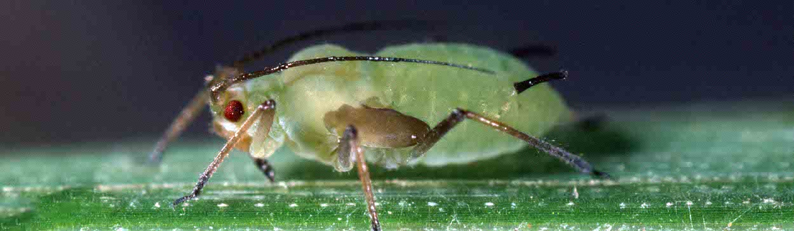
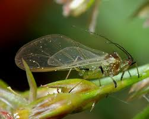
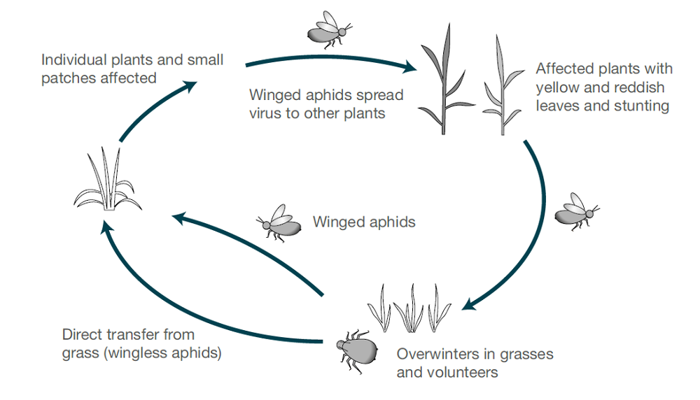

# Puceron des céréales (*Sitobion avenae*)

## Présentation

Le **puceron des céréales** (*Sitobion avenae*) est l'un des ravageurs les plus importants sur le plan économique dans les cultures céréalières à travers le monde. Il infeste principalement :

- Le blé
- L'orge
- L'avoine
- Le seigle
- Le triticale
- Les graminées sauvages

Ce ravageur provoque des dégâts directs par succion et agit comme vecteur de maladies virales graves, notamment le **virus de la jaunisse nanisante de l'orge (VJNO / BYDV)**.

Le puceron des céréales est particulièrement problématique dans les régions agricoles à climat tempéré d'Europe, d'Asie et d'Amérique du Nord.

---

# Taxonomie et classification

| Catégorie | Information |
|---|---|
| Nom scientifique | *Sitobion avenae* |
| Nom commun | Puceron des céréales |
| Ordre | Hemiptera |
| Famille | Aphididae |
| Type d'alimentation | Insecte piqueur-suceur |

---

# Répartition géographique

Le ravageur est répandu dans :

- Europe
- Asie centrale
- Chine
- Amérique du Nord
- Proche-Orient
- Afrique du Nord

Les populations sont fortement influencées par :
- Les températures hivernales
- L'humidité
- La densité des cultures
- Les ennemis naturels
- Les pratiques agricoles

---

# Plantes hôtes

## Hôtes principaux

| Culture | Sensibilité |
|---|---|
| Blé | Très élevée |
| Orge | Élevée |
| Avoine | Modérée |
| Seigle | Modérée |
| Triticale | Élevée |

---

## Hôtes secondaires

Le puceron peut survivre sur :
- Les repousses de céréales
- Les graminées sauvages
- Les graminées fourragères
- D'autres graminées hôtes en période extra-saisonnière

Ces hôtes alternatifs sont importants pour l'hivernation et la persistance des virus.

---

# Identification

## Adultes aptères et ailés

### Caractéristiques
- Insectes à corps mou
- Forme élancée
- Coloration vert à vert jaunâtre
- Longues antennes noires
- Siphoncules (cornicules) sombres bien visibles

### Taille
- Environ 2–3 mm de longueur

---

## Formes ailées

Les adultes ailés se développent en cas de :
- Forte densité de population
- Stress de la plante hôte
- Déclin de la qualité de l'hôte
- Pression environnementale

Les pucerons ailés sont responsables de :
- La dispersion à longue distance
- La colonisation de nouvelles parcelles
- La transmission du virus entre cultures

---

# Cycle biologique

## Reproduction

Le puceron des céréales se reproduit rapidement par :

### Parthénogenèse
Les femelles donnent naissance à des larves vivantes sans accouplement pendant la majeure partie de la saison de croissance.

### Reproduction sexuée
Elle intervient dans les régions plus froides avant l'hiver.

---

# Stades de développement

1. Œuf
2. Nymphe (plusieurs stades larvaires)
3. Adulte

Dans des conditions favorables, le développement peut s'accomplir en :
- 7–10 jours

Cela permet une croissance explosive des populations.

---

# Biologie saisonnière

## Printemps

- La colonisation des cultures céréalières débute
- Les populations augmentent rapidement

## Été

- Les pics d'infestation surviennent lors de l'épiaison et du remplissage du grain
- Les pertes de rendement sont les plus importantes

## Automne

- Migration vers les céréales d'hiver
- Le risque de transmission virale s'accroît

---

# Dégâts par alimentation

Le puceron des céréales introduit ses stylets dans le phloème des plantes pour en extraire la sève.

---

# Dégâts directs

## Effets physiologiques

- Réduction de la photosynthèse
- Appauvrissement en nutriments
- Stress hydrique
- Remplissage du grain perturbé

---

## Symptômes visibles

| Symptôme | Description |
|---|---|
| Chlorose | Jaunissement des feuilles |
| Enroulement foliaire | Réaction au stress |
| Production de miellat | Sécrétions collantes |
| Fumagine | Développement fongique secondaire |
| Rabougrissement | Vigueur végétale réduite |

---

# Dégâts sur le grain

En cas d'infestation sévère :
- Réduction du poids de mille grains
- Mauvaise qualité du grain
- Accumulation de protéines diminuée
- Valeur marchande réduite

---

# Importance économique

Les pertes de rendement dépendent de :
- Le stade de la culture
- La densité de population
- Les conditions climatiques
- La transmission virale

---

# Pertes de rendement potentielles

| Niveau d'infestation | Perte de rendement estimée |
|---|---|
| Faible | 1–5 % |
| Modéré | 5–15 % |
| Sévère | 20–50 % |

Les pertes sont significativement plus élevées en présence de maladies virales.

---

# Transmission virale

## Virus de la jaunisse nanisante de l'orge (BYDV)

Le puceron des céréales est un vecteur majeur du BYDV.

---

# Symptômes du BYDV

- Jaunissement ou rougissement des feuilles
- Nanisme
- Réduction du tallage
- Mauvaise formation du grain
- Perte de rendement significative

---

# Processus de transmission virale

1. Le puceron se nourrit sur une plante infectée
2. Le virus pénètre dans l'organisme du puceron
3. Le puceron transmet le virus aux plantes saines lors de son alimentation

L'efficacité de transmission dépend de :
- L'âge du puceron
- La température
- La durée d'alimentation
- La souche virale

---

# Conditions environnementales favorables aux infestations

| Facteur | Condition favorable |
|---|---|
| Température | 15–25 °C |
| Hivers doux | Bonne survie hivernale |
| Cultures denses | Colonisation accrue |
| Temps sec | Favorise souvent les pucerons |
| Populations de prédateurs réduites | Pullulations rapides |

---

# Surveillance et observations

La détection précoce est essentielle.

---

# Méthodes d'observation

## Inspection visuelle

À inspecter :
- Feuilles supérieures
- Épis/épillets
- Base des tiges
- Bordures de parcelles

---

## Échantillonnage au filet fauchoir

Utile pour :
- Estimer la densité de population
- Détecter les pucerons ailés en migration

---

## Pièges jaunes englués

Permettent de surveiller :
- L'activité de vol
- Le calendrier de migration
- La pression saisonnière

---

# Seuils économiques d'intervention

Les seuils varient selon les régions et les stades de la culture.

## Valeurs de référence générales

| Stade de la culture | Seuil |
|---|---|
| Végétation précoce | 10–20 pucerons/talle |
| Épiaison | 30–50 pucerons/épi |
| Remplissage du grain | Variable selon le stress |

Les recommandations locales doivent toujours être prioritaires.

---

# Protection intégrée des cultures (PIC)

Une lutte efficace nécessite la combinaison de plusieurs stratégies.

---

# 1. Variétés résistantes

Certaines variétés céréalières présentent :
- Une résistance partielle
- Une tolérance
- Une reproduction réduite des pucerons

---

# 2. Lutte culturale

## Pratiques recommandées

- Optimisation de la date de semis
- Destruction des repousses de céréales
- Gestion des adventices
- Fertilisation équilibrée
- Éviter les excès d'azote

Un excès d'azote favorise souvent la multiplication des pucerons.

---

# 3. Lutte biologique

Les ennemis naturels sont d'une importance primordiale.

---

# Principaux organismes utiles

| Organisme utile | Rôle |
|---|---|
| Coccinelles | Prédation des pucerons |
| Chrysopes | Prédation larvaire |
| Syrphes | Prédation larvaire |
| Parasitoïdes (hyménoptères) | Parasitisme des pucerons |
| Araignées | Prédation généraliste |

La préservation des insectes utiles peut réduire considérablement les pullulations.

---

# 4. Lutte chimique

L'application d'insecticides peut être nécessaire lors d'infestations sévères.

---

# Principaux groupes d'insecticides

| Groupe IRAC | Type |
|---|---|
| 3A | Pyréthrinoïdes |
| 4A | Néonicotinoïdes |
| 9B | Inhibiteurs d'alimentation |
| 29 | Perturbateurs sélectifs d'alimentation |

---

# Gestion de la résistance

Les pucerons peuvent développer rapidement une résistance aux insecticides.

## Bonnes pratiques

- Rotation des groupes IRAC
- Éviter les traitements inutiles
- Préserver les ennemis naturels
- Appliquer en fonction des seuils
- Éviter les expositions répétées à des doses sublétales

---

# Agriculture de précision et surveillance numérique

L'agriculture moderne fait de plus en plus appel à des systèmes numériques pour la surveillance des pucerons.

---

# Technologies utilisées

## Télédétection
Permet de détecter :
- Les zones de stress
- Les chloroses
- La réduction de la vigueur du couvert végétal

---

## Modèles basés sur la météo

Prévoient :
- Les périodes de migration
- La croissance des populations
- Le risque viral

---

## Systèmes de surveillance intelligents

Exemples :
- Pièges à insectes connectés (IoT)
- Reconnaissance d'images par IA
- Surveillance par drone
- Analytique satellitaire

---

# Impacts du changement climatique

Le changement climatique pourrait accroître la pression du puceron des céréales via :
- Des hivers plus doux
- Des périodes de reproduction allongées
- Une migration plus précoce
- Un élargissement de l'aire de répartition

Cela pourrait également augmenter l'incidence du BYDV.

---

# Recommandations pour la stratégie d'échantillonnage

| Surface de la parcelle | Points d'échantillonnage conseillés |
|---|---|
| < 10 ha | 5–10 points |
| 10–50 ha | 10–20 points |
| > 50 ha | 20+ points |

Ne pas se limiter aux bordures de parcelles.

---

# Périodes de risque critiques

Les stades de culture les plus critiques sont :
- Tallage
- Montaison
- Épiaison
- Remplissage du grain

Les infections virales survenant aux stades précoces sont particulièrement dommageables.

---

# Erreurs fréquentes dans la gestion

## Problèmes courants

- Traitements sans vérification du seuil
- Fertilisation azotée excessive
- Négligence des ennemis naturels
- Détection tardive du virus
- Mauvaise gestion des repousses
- Dépendance excessive aux pyréthrinoïdes

---

# Résumé de la stratégie de gestion optimale

## Programme intégré recommandé

1. Surveiller régulièrement les parcelles
2. Utiliser les seuils économiques d'intervention
3. Préserver les insectes utiles
4. Contrôler les repousses de céréales
5. Optimiser la gestion azotée
6. Utiliser des variétés résistantes lorsqu'elles sont disponibles
7. Alterner les groupes d'insecticides
8. Surveiller la pression virale
9. Intégrer les systèmes de prévision numérique

---

# Points clés à retenir

- Le puceron des céréales est un ravageur majeur des céréales à l'échelle mondiale.
- Les pertes de rendement résultent à la fois des dégâts directs par succion et de la transmission virale.
- Le BYDV représente l'une des menaces associées les plus sérieuses.
- Les hivers doux et la céréaliculture intensive augmentent le risque de pullulation.
- La protection intégrée des cultures constitue la stratégie de lutte la plus durable.
- La préservation des agents de régulation biologique est essentielle pour une gestion à long terme.

---

# Glossaire

| Terme | Définition |
|---|---|
| Puceron | Insecte suceur de sève |
| Stylet | Pièce buccale piqueuse |
| Miellat | Sécrétion sucrée du puceron |
| BYDV | Virus de la jaunisse nanisante de l'orge |
| Parthénogenèse | Reproduction asexuée |
| IRAC | Insecticide Resistance Action Committee |
| Vecteur | Organisme transmettant des agents pathogènes |

---

# Ressources complémentaires

## Organisations
- EPPO
- FAO
- IRAC
- AHDB
- CIMMYT

## Paramètres de surveillance recommandés
- Densité de pucerons
- Migration des pucerons ailés
- Température
- Stade de développement de la culture
- Activité des insectes utiles
- Incidence virale